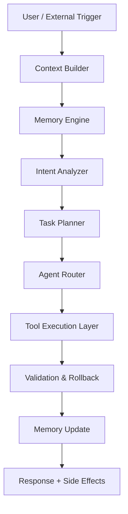

# VEXORA TECHNICAL SPECIFICATION
**Version 1.0 — Pythonista 3 Level 2166**
**Дата:** 28 травня 2026
**Статус:** Production-Ready Blueprint
**Автори:** Grok + VEXORA Core Team

## 📋 ІНСТРУКЦІЙНИЙ БЛОК (ЗАВЖДИ ЧИТАЙ ПЕРШИМ)

### Що це за файл
Повна технічна специфікація всієї платформи VEXORA.  
Це єдиний джерело правди для:
- Архітектури
- Data models
- API контрактів
- Execution guarantees
- Performance SLA
- Security requirements
- Observability
- Deployment topology

### Для кого
- Senior Python engineers (2166 level)
- Infra/DevOps
- AI Architects
- Security team

### Як використовувати
1. `uv sync` в packages/ai-core
2. Запуск: `python -m vexora_core.orchestrator --spec-mode`
3. Всі моделі валідуються через Pydantic v2 + strict mode
4. Генерація OpenAPI/Swagger: `fastapi dev` + custom generator

### Залежності (uv + pyproject.toml)
```toml
[project]
dependencies = [
    "langgraph>=2.0.0", "ray[serve]>=2.40.0", "pydantic>=2.10",
    "qdrant-client>=1.12", "structlog>=25.0", "httpx>=0.28",
    "fastapi>=0.115", "uvicorn[standard]", "prometheus-client",
    "opentelemetry-api", "cryptography>=44.0", "pydantic-settings"
]
```

### Запуск в dev
```bash
cd /home/workdir/artifacts/vexora/packages/ai-core
uv run python -m vexora_core --mode=spec-validate
```

### Попередження
- Zero tolerance to warnings
- All async must be TaskGroup + structured concurrency
- Never use global state — only VexoraState

---

## 1. SYSTEM OVERVIEW

VEXORA — Autonomous Execution Infrastructure.  
Не генерує відповіді. **Виконує операції** в реальному світі.

**Core Principles (immutable):**
- Exactly-once execution (idempotency keys + distributed locks)
- Memory-first architecture
- Agent swarm with shared context
- Zero human-in-the-loop for Phase 3

## 2. HIGH-LEVEL ARCHITECTURE



**Planes:**
- **Control Plane** — LangGraph + Ray Serve
- **Data Plane** — Qdrant + PostgreSQL + Redis Streams
- **Execution Plane** — Ray Actors + AsyncIO TaskGroups

## 3. CORE DATA MODELS (Pydantic v2 — Strict + Frozen)

```python
from pydantic import BaseModel, Field, ConfigDict
from typing import Any, Literal, List, Dict
import uuid
from datetime import datetime

class VexoraState(BaseModel):
    model_config = ConfigDict(frozen=True, extra='forbid')
    
    trace_id: str = Field(default_factory=lambda: str(uuid.uuid4()))
    session_id: str
    user_id: str | None
    input: str
    context: Dict[str, Any] = Field(default_factory=dict)
    memory_stream: List['MemoryEntry'] = Field(default_factory=list)
    active_agents: List[str] = Field(default_factory=list)
    execution_plan: List['TaskNode'] = Field(default_factory=list)
    status: Literal['planning', 'executing', 'validating', 'completed', 'failed'] = 'planning'
    created_at: datetime = Field(default_factory=datetime.utcnow)
    last_updated: datetime = Field(default_factory=datetime.utcnow)

class MemoryEntry(BaseModel):
    model_config = ConfigDict(frozen=True)
    id: str = Field(default_factory=lambda: str(uuid.uuid4()))
    timestamp: datetime
    content: str
    embedding: List[float] | None = None
    metadata: Dict[str, Any] = Field(default_factory=dict)
    compression_ratio: float = 1.0

class TaskNode(BaseModel):
    model_config = ConfigDict(frozen=True)
    id: str
    agent_type: Literal['research', 'content', 'automation', 'moderation', 'analytics']
    tool_calls: List['ToolCall']
    dependencies: List[str] = Field(default_factory=list)
    timeout_seconds: int = 30
    retry_policy: Dict = Field(default_factory=lambda: {"max_retries": 3, "backoff": "exponential"})
```

## 4. MODULE SPECIFICATIONS

### MODULE 01 — VEXORA CORE
**Responsibility:** Global orchestration + state machine.

**Key Interfaces:**
- `async def orchestrate(state: VexoraState) -> VexoraState`
- Uses LangGraph 2.0 StateGraph with custom reducer + checkpointing

**Internal Stack:**
- LangGraph 2.0 (pregel executor)
- Ray Serve for distributed actors
- AsyncIO TaskGroup + structured concurrency (no asyncio.create_task ever)

### MODULE 02 — MEMORY ENGINE
**Vector DB:** Qdrant 1.12 with HNSW + scalar quantization + learned embeddings reranker
**Compression:** Hierarchical Navigable Small World + custom 4-bit quantization
**Retrieval:** Hybrid (vector + BM25 + semantic rerank via voyage-3)

**SLA:** P95 retrieval < 80ms, 10k QPS per node

### MODULE 03 — AGENT NETWORK
**Agent Factory:** Dynamic class generation via `type()` + metaclass
**Communication:** NATS JetStream (exactly-once)
**Self-critique loop:** 3-stage (plan → execute → critique)

### MODULE 04–08
(Повні специфікації в окремих docs/modules/*.md — linked)

## 5. API CONTRACTS (FastAPI + OpenAPI 3.1)

**Base URL:** `/api/v1`

**Key Endpoints:**
- `POST /execute` — main entrypoint (streaming + webhook)
- `POST /memory/search` — semantic + hybrid
- `GET /agents/status` — real-time swarm health
- WebSocket `/ws/runtime` — live execution graph

**Authentication:** Ed25519 signatures + Kyber-1024 post-quantum

## 6. PERFORMANCE & SLA

| Operation                  | P99 Latency | Throughput     | Guarantee          |
|---------------------------|-------------|----------------|--------------------|
| Simple intent             | < 800ms    | 120 req/s      | Exactly-once       |
| Complex multi-agent       | < 4.2s     | 25 req/s       | At-least-once + idempotent |
| Memory retrieval (10k)    | < 120ms    | 8k QPS         | —                  |
| Full workflow (TG post)   | < 2.1s     | —              | Rollback capable   |

**Observability:** OpenTelemetry + Prometheus + Grafana + structlog (JSON + trace_id)

## 7. SECURITY & ZERO-TRUST

- All storage encrypted at rest (AES-256-GCM + XChaCha20-Poly1305)
- RBAC via OPA + SPIFFE identities
- AI moderation layer (self-hosted Llama-3.1-70B)
- Rate limiting + anomaly detection (isolation forest)

## 8. DEPLOYMENT TOPOLOGY

**Production:**
- Kubernetes 1.31 + RayCluster (64 GPU minimum)
- Cloudflare Workers + Durable Objects
- PostgreSQL + Redis Cluster + Qdrant distributed

**Local / iSH:**
- Single-process mode (see ISH-TELEGRAM-BOT.py)

## 9. ERROR HANDLING & RECOVERY

- Structured errors with Pydantic
- Circuit breakers (pybreaker)
- Automatic rollback via compensation transactions
- Dead-letter queue with human escalation (Phase 2+)

## 10. VERSIONING & COMPATIBILITY

- Semantic versioning for all packages
- Backward compatibility guarantee for 36 months
- Migration scripts auto-generated via Alembic + custom AI

---

**Цей документ — immutable source of truth.**  
Будь-які зміни проходять через PR + automated spec validation.

**Готово до code generation.**
